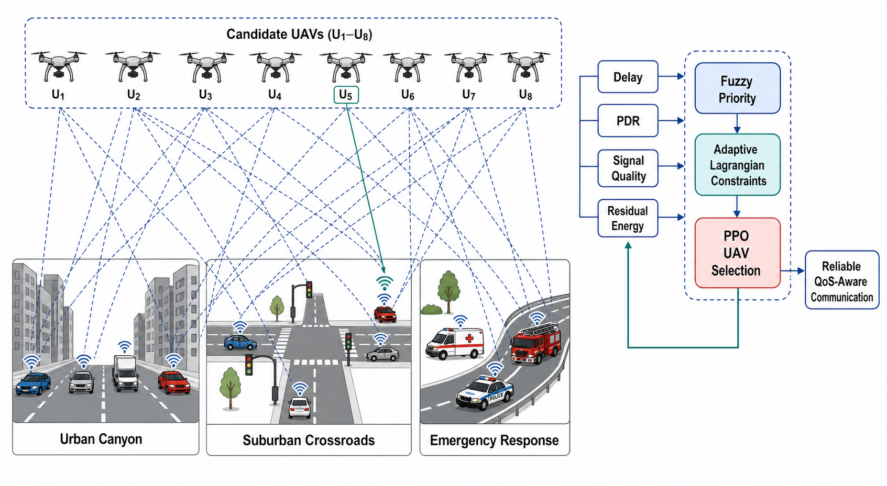
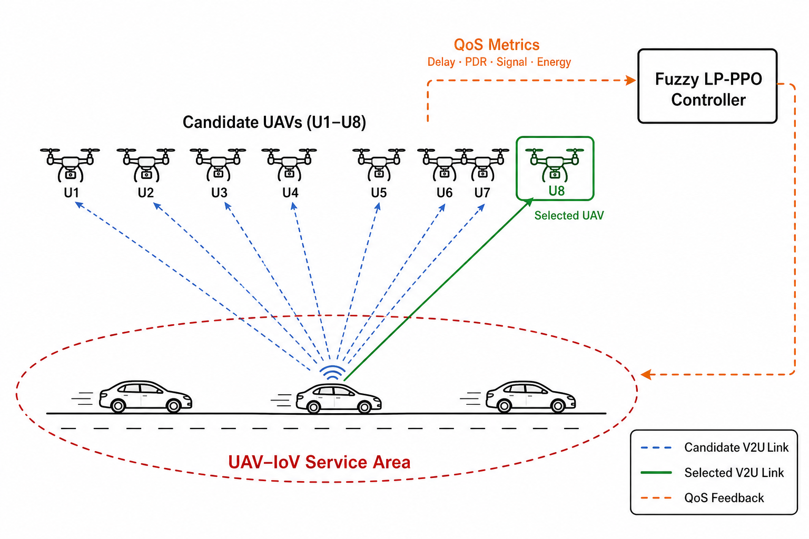

REGULAR PAPER

# A fuzzy Lagrangian proximal policy optimization approach for reliable UAV selection in dynamic Internet of Vehicles

[Author Name]¹ · [Co-author Name]¹ · [Supervisor Name]¹

Received: [Date] / Accepted: [Date] / Published online: [Date]  
© The Author(s), under exclusive licence to [Publisher Name] [Year]

## Abstract

The growth of connected vehicles and time-sensitive Internet of Vehicles (IoV) services has increased demand for reliable, low-latency communication. Unmanned aerial vehicle (UAV)-assisted networking can extend coverage, but selecting an appropriate UAV is difficult when mobility, link quality, and residual energy vary dynamically. Conventional greedy selection and unconstrained learning methods struggle to balance communication quality, energy availability, and quality-of-service (QoS) requirements. This paper addresses UAV selection while jointly controlling delay, packet delivery ratio (PDR), signal quality, and energy constraints. We propose a fuzzy Lagrangian proximal policy optimization (Fuzzy LP-PPO) approach that combines fuzzy priority rules, adaptive Lagrangian penalties, and scenario-specific PPO learning. The framework prioritizes risky links, updates constraint multipliers, and learns selection policies across eight candidate UAVs. Simulations cover urban-canyon, suburban-crossroads, and emergency-response environments, with policies trained for 100 episodes of 50 steps per scenario. Compared with a reward-aware heuristic under a common evaluation, the trained policy achieves a 48.1% increase in episode reward, a 7.8% reduction in average delay, a 0.39-percentage-point increase in PDR, and a 14.8% improvement in signal quality. These results suggest that Fuzzy LP-PPO provides an effective basis for adaptive and constraint-aware communication in heterogeneous, non-stationary UAV-IoV environments.

**Keywords** Internet of Vehicles · Unmanned aerial vehicles · Fuzzy logic · Lagrangian optimization · Proximal policy optimization · Reliable communication

**Mathematics Subject Classification** 68T05 · 68T07 · 68T40

Extended author information available on the last page of the article

## 1 Introduction

The Internet of Vehicles (IoV) extends conventional vehicular networks by enabling continuous information exchange among vehicles, roadside infrastructure, edge servers, and intelligent transportation services [1–3]. This connectivity supports applications such as cooperative driving, traffic monitoring, collision warning, emergency coordination, multimedia delivery, and autonomous navigation. Many of these applications are delay-sensitive and depend on reliable wireless links. A communication decision that is acceptable for ordinary traffic information may be unsuitable for a safety message or an emergency request, where even a short interruption can reduce service effectiveness. The increasing number of connected vehicles therefore creates a need for communication mechanisms that can preserve low delay, acceptable packet delivery, and stable coverage while the network topology changes rapidly.

Terrestrial communication infrastructure alone may not always satisfy these requirements. Buildings, road geometry, congestion, infrastructure failures, and temporary traffic surges can create coverage gaps or overload fixed access points [4, 5]. Unmanned aerial vehicles (UAVs) can operate as flexible aerial communication nodes and provide coverage where terrestrial connectivity is weak or unavailable. Their mobility and rapid deployment make them useful for dense urban roads, sparse suburban intersections, disaster zones, and emergency-response operations. A vehicle can communicate through a nearby UAV instead of relying exclusively on a distant or congested ground station. This can improve link availability and make the network more responsive to changing traffic conditions.

The benefits of UAV-assisted IoV communication are accompanied by several operational challenges. UAVs have limited onboard energy, finite communication range, and links whose quality varies with the relative positions of vehicles and aerial nodes. Vehicles may move out of range quickly, while the UAV offering the strongest signal at one instant may have insufficient residual energy or may produce excessive delay at the next instant. Selecting the nearest UAV is therefore not always equivalent to selecting the most reliable one. Similarly, repeatedly selecting the UAV with the strongest instantaneous signal may overload a small part of the fleet and accelerate battery depletion. Reliable UAV selection must consider multiple, sometimes conflicting, indicators rather than optimizing a single metric.

In a dynamic IoV environment, the selection decision is influenced by vehicle–UAV distance, signal quality, packet delivery ratio (PDR), communication delay, and residual UAV energy. These indicators interact with one another. A short link generally improves signal quality, but the corresponding UAV may have low remaining energy. An energy-rich UAV may be farther away and introduce additional delay. A decision strategy must consequently balance immediate communication performance with longer-term fleet availability. The problem becomes more difficult when operating conditions differ across road layouts and change during an episode. Urban corridors contain dense traffic and obstruction-sensitive links, suburban crossroads contain sparse and longer connections, and emergency environments can experience sudden increases in vehicles and communication demand.

Figure 1 illustrates the UAV selection problem considered in this study. Vehicles operating in urban-canyon, suburban-crossroads, and emergency-response scenarios observe several candidate UAVs. For every candidate link, the system evaluates delay, PDR, signal quality, residual energy, and distance-related information. These measurements are passed to a fuzzy-priority mechanism and an adaptive Lagrangian constraint layer before the PPO policy selects a UAV. The resulting communication outcome is returned to the learning process as feedback. This closed decision loop allows the policy to respond to both immediate link conditions and accumulated constraint violations.

**Fig. 1** System model of the proposed Fuzzy LP-PPO framework for reliable UAV selection in dynamic IoV scenarios.

Traditional UAV-selection strategies commonly use fixed rules such as random selection, minimum distance, strongest signal, or maximum residual energy [6–8]. These policies are easy to implement and require little computation, but each rule represents only a partial view of communication quality. Random selection cannot exploit current network information. The nearest-UAV policy ignores battery state and other QoS indicators. Strongest-signal selection may improve the instantaneous link while neglecting delay and long-term energy balance. Energy-aware greedy selection protects battery resources but may choose a distant node with weak communication performance. A weighted reward-aware rule can combine several measurements, although fixed weights cannot adapt effectively when scenario conditions or constraint severities change.

Reinforcement learning (RL) provides an alternative by allowing an agent to learn a selection policy through repeated interaction with the communication environment [9, 10]. At each decision step, the agent observes the vehicle state and candidate-UAV link information, selects an action, and receives a reward determined by the communication outcome. Over many episodes, it learns actions that maximize cumulative performance rather than applying one fixed decision rule. Proximal policy optimization (PPO) is particularly suitable for this problem because its clipped policy update provides stable learning and limits excessively large changes between successive policies [11]. PPO can also use high-dimensional observations and directly learn nonlinear relationships among distance, signal, delay, PDR, and energy.

Nevertheless, ordinary PPO does not automatically guarantee compliance with QoS requirements. A policy can obtain a high average reward while still producing unacceptable delay or selecting low-energy UAVs in some network states. The final behavior depends strongly on manually chosen reward coefficients. If a penalty is too small, the agent may ignore the associated constraint; if it is too large, learning may become unstable or overly conservative. Furthermore, numerical reward terms do not always express the gradual and uncertain nature of communication urgency. For example, a link near the delay threshold should not necessarily be treated in exactly the same way as either a clearly safe or severely delayed link.

Fuzzy logic offers a useful mechanism for representing such gradual priorities [12, 13]. Instead of relying only on hard binary decisions, fuzzy rules estimate the urgency of a candidate link from its delay, PDR, signal quality, and energy condition. In the proposed framework, increased delay, weak PDR, poor signal quality, or depleted energy raises the fuzzy priority associated with a risky communication state. An additional scenario-dependent boost allows emergency-response conditions to receive greater attention. The resulting priority value supplements the numerical QoS score and helps organize candidate UAVs according to their overall communication suitability.

Lagrangian optimization complements the fuzzy layer by adapting the penalties applied to constraint violations [14, 15]. The proposed environment maintains non-negative multipliers for delay, PDR, energy, and signal constraints. When a violation is observed, the corresponding multiplier is increased through a dual update. Repeated violations therefore become progressively more expensive, whereas satisfied constraints do not create additional penalties. This mechanism reduces dependence on a permanently fixed penalty configuration and encourages the policy to account for the constraints that are most difficult under the current operating conditions.

Based on these observations, this study proposes a fuzzy Lagrangian proximal policy optimization (Fuzzy LP-PPO) framework for reliable UAV selection in dynamic IoV networks. The observation supplied to the agent contains the normalized vehicle location and, for each of eight UAVs, relative position, signal quality, and remaining energy. Candidate links are evaluated using communication range, delay, PDR, energy, and signal conditions. The fuzzy module assigns a risk-aware priority, while the Lagrangian module updates the cost of observed QoS violations. PPO then learns which ranked candidate should serve the vehicle. The reward combines task-service utility, distance and energy costs, QoS quality, fuzzy priority, and adaptive constraint penalties.

The framework is evaluated in three synthetic but distinct operating environments. The urban-canyon scenario represents dense corridor movement and emphasizes robust connectivity. The suburban-crossroads scenario represents sparse movement over a wider road layout and stresses energy-aware operation. The emergency-response scenario introduces non-stationary conditions and tests the ability of the policy to adapt when traffic and service demand change. Separate policies are trained for each scenario for 100 episodes, with 50 interaction steps in every episode. This scenario-specific design prevents one road configuration from dominating the policy and enables the learned behavior to reflect different communication priorities.

The trained model is compared under a common evaluation with random, nearest-UAV, strongest-signal, energy-aware greedy, and reward-aware selection strategies. Averaged across the three scenarios, the trained policy improves episode reward by approximately 48.1% and reduces average delay by about 7.8% relative to the reward-aware heuristic. It also provides a 0.39-percentage-point improvement in PDR and approximately 14.8% higher signal quality. These results show that the learned policy can exploit the combined fuzzy, constrained, and scenario-specific representation more effectively than the fixed reward-aware rule. The comparison is conducted using common project metrics and reward definitions so that the reported values are not obtained by directly comparing incompatible reward scales.

The main contributions of this work are summarized as follows.

1. A fuzzy Lagrangian PPO framework is developed for UAV selection in IoV communication. It integrates fuzzy link prioritization, adaptive Lagrangian penalties, and PPO learning to jointly account for delay, PDR, signal quality, distance, and residual UAV energy.

2. A scenario-aware simulation and training system is constructed for urban-canyon, suburban-crossroads, and emergency-response environments. The system includes eight candidate UAVs, long-horizon episodic training, dynamic vehicle movement, QoS feedback, model persistence, and reproducible evaluation outputs.

3. The proposed method is evaluated against multiple rule-based and learned-selection references using common performance indicators. The results demonstrate improved cumulative reward, lower average delay, higher PDR, and stronger average signal quality relative to the reward-aware heuristic, while also exposing the trade-offs among communication reliability and energy availability.

The remainder of this paper is organized as follows. Section 2 reviews existing work on UAV-assisted IoV communication, intelligent UAV selection, fuzzy decision systems, and constrained reinforcement learning. Section 3 describes the system model, communication metrics, mobility assumptions, QoS constraints, and simulation scenarios. Section 4 presents the proposed Fuzzy LP-PPO framework, including fuzzy priority estimation, Lagrangian multiplier updates, reward construction, and PPO training. Section 5 reports the simulation configuration and compares the proposed method with the selected baselines. Finally, Section 6 concludes the paper and outlines future work on multi-agent coordination, more realistic wireless channels, and online deployment.

The abbreviations used throughout this paper are listed in Table 1, while the principal variables employed in the system model and proposed Fuzzy LP-PPO formulation are summarized in Table 2.

**Table 1** List of abbreviations

| Abbreviation | Description |
|---|---|
| IoV | Internet of Vehicles |
| UAV | Unmanned aerial vehicle |
| QoS | Quality of service |
| PDR | Packet delivery ratio |
| RL | Reinforcement learning |
| DRL | Deep reinforcement learning |
| PPO | Proximal policy optimization |
| Fuzzy LP-PPO | Fuzzy Lagrangian proximal policy optimization |
| MLP | Multilayer perceptron |
| GAE | Generalized advantage estimation |
| V2U | Vehicle-to-UAV communication |
| RSS | Received signal strength |

**Table 2** List of variables

| Variable | Description |
|---|---|
| $t$ | Current communication decision step |
| $H$ | Number of interaction steps in one episode |
| $N_{\mathrm{ep}}$ | Number of training episodes |
| $\mathcal{V}(t)$ | Set of active vehicles at decision step $t$ |
| $\mathcal{U}=\{U_1,U_2,\ldots,U_8\}$ | Set of eight candidate UAVs |
| $\mathbf{p}_v(t)$ | Position of vehicle $v$ at decision step $t$ |
| $\mathbf{p}_u(t)$ | Three-dimensional position of UAV $u$ at decision step $t$ |
| $d_{v,u}(t)$ | Euclidean distance between vehicle $v$ and UAV $u$ |
| $R_{\mathrm{comm}}$ | Maximum UAV communication range |
| $S_{v,u}(t)$ | Signal-quality value of the vehicle–UAV link |
| $D_{v,u}(t)$ | Communication delay of the vehicle–UAV link |
| $P_{v,u}(t)$ | Packet delivery ratio of the vehicle–UAV link |
| $E_u(t)$ | Residual energy of UAV $u$ |
| $s_t$ | State observed by the PPO agent at step $t$ |
| $a_t$ | UAV-selection action chosen at step $t$ |
| $r_t$ | Immediate reward obtained after action $a_t$ |
| $\pi_{\theta}(a_t\mid s_t)$ | PPO policy parameterized by $\theta$ |
| $V_{\phi}(s_t)$ | State-value function parameterized by $\phi$ |
| $F_{v,u}(t)$ | Fuzzy priority assigned to candidate link $(v,u)$ |
| $g_i(t)$ | Violation magnitude of QoS constraint $i$ |
| $\lambda_i(t)$ | Adaptive Lagrangian multiplier for constraint $i$ |
| $\eta_{\lambda}$ | Learning rate used for Lagrangian multiplier updates |
| $\gamma$ | Reward discount factor |
| $\epsilon$ | PPO clipping parameter |
| $A_t$ | Generalized advantage estimate at step $t$ |

## 2 Related work

Recent work on UAV-assisted Internet of Vehicles (IoV) and vehicular edge computing (VEC) has moved from static optimization toward deep reinforcement learning (DRL), federated learning, attention mechanisms, and multi-agent control. The dominant application is computation offloading, although the underlying decisions—user association, relay or server selection, trajectory control, caching, and resource allocation—are directly relevant to reliable UAV selection. This review concentrates on 20 peer-reviewed studies published from 2023 to 2026. Because the papers use different objectives, units, baselines, and simulators, their percentages are reported only as within-paper improvements; they must not be interpreted as a direct cross-paper ranking.

### 2.1 Detailed review of recent studies

Zhao et al. [16] formulated collaborative task offloading and scheduling in a mobile-edge IoV as a Markov decision process and used deep deterministic policy gradient (DDPG) with experience replay to handle the continuous allocation space. Their numerical MEC environment jointly modeled vehicle-terminal offloading, server collaboration, delay, and energy; no public mobility dataset was reported. The method improved system cost by 9.12% under different task sizes and showed stable convergence. Its advantage is continuous, long-horizon optimization, whereas its limitations are dependence on a simulated channel/task model, fixed reward weights, and the absence of UAV energy, link PDR, and explicit constraint adaptation.

Omoniwa et al. [17] proposed communication-enabled multi-agent decentralized double DQN (CMAD-DDQN), in which UAVs exchange telemetry with their nearest neighbors and learn three-dimensional trajectories under mobile ground users, inter-cell interference, and finite UAV energy. Evaluation was simulation-based rather than dataset-driven and targeted energy-efficient coverage during terrestrial-network failure or disaster operation. CMAD-DDQN improved energy efficiency by approximately 15%, 65%, and 85% over MAD-DDQN, MADDPG, and a random policy, respectively. Direct inter-UAV collaboration is a major merit, but the approach introduces communication overhead and focuses on trajectory/coverage energy efficiency rather than per-link PDR, delay, and residual-energy constraint satisfaction.

Liu et al. [18] developed a PPO-based joint optimization (PBJO) method for UE-to-edge-server matching and selection among three UAV hovering positions. The authors simulated nine user equipments, three edge-computing servers, and one relay UAV in a $400\times400$ m area with standard air-to-ground channel parameters; positions were synthetically generated and no public dataset was used. At 1 W transmit power, PBJO achieved about 0.88 s average delay, 12% below the greedy baseline and approximately 25.4% below the random baseline. PPO provides stable mixed-decision learning, but the single-UAV model optimizes delay alone and leaves energy, PDR, interference, mobility realism, and multiple QoS constraints largely unaddressed.

Shi et al. [19] studied a cloud–edge–vehicle architecture and proposed TODM-DDPG for continuous task-destination and partial-offloading decisions. The numerical environment included vehicle mobility, IEEE 802.11p/5G communication, local computation, roadside-edge servers, and cloud execution; the study reported no external dataset. TODM-DDPG reduced the combined delay–energy system cost by about 13% on average compared with DQN and actor–critic baselines. The work demonstrates the value of continuous actor–critic control in VEC, but it is terrestrial, uses a scalar weighted cost, and does not model UAV association, fuzzy uncertainty, or explicit long-term QoS feasibility.

Kang et al. [20] modeled UAV/RSU-assisted avatar-task migration for vehicular metaverse services as a partially observable Markov decision process. Their TF-MAPPO framework combined a Transformer with multi-agent PPO for migration and pre-migration, while a blockchain/WeBASE implementation recorded resource transactions; evaluation was numerical and did not use a standard mobility dataset. TF-MAPPO improved performance by roughly 2% over conventional MAPPO and reduced avatar execution latency by about 20%. Attention captures inter-agent dependence and blockchain improves traceability, but both components increase computation and communication overhead, and the reward still does not guarantee link-level PDR, signal, or battery thresholds.

Li et al. [21] proposed GAN-MATD3 for joint UAV trajectory, task allocation, and partial offloading in a multi-UAV system. UAVs and ground users were treated as heterogeneous agents, while a generative adversarial network synthesized environment states for offline auxiliary training; experiments used a synthetic $100\times100$ m region rather than a named public dataset. The paper reports lower UAV energy use and task latency than its benchmark algorithms, but does not provide one universal percentage in its abstracted results. The approach reduces real-world interaction and agent observation dimensions, yet GAN distribution error, MATD3 complexity, and the lack of explicit QoS-constraint guarantees limit deployment confidence.

Gupta and Fernando [22] embedded a federated-reinforcement-learning parameter server in a UAV for collaborative C-V2X learning. Nonlinear Q-value mappings dynamically weighted local contributions, and the framework reduced repeated vehicle–UAV model exchange while avoiding gross raw-data offloading; evaluation used a controlled C-V2X learning experiment and no public traffic dataset was identified. The approach reduced communication rounds by up to 40% relative to gross data offloading. Privacy and communication efficiency are clear merits, but non-IID vehicle data, federated aggregation delay, UAV availability, and the absence of direct link-selection/QoS optimization remain limitations.

Huang et al. [23] introduced Fed-IDCCO, a federated DRL method that jointly chooses UAV data caching and vehicle-task offloading while the macro base station aggregates models. Unlike most studies in this review, it used more than seven million trajectory records from 4,316 Shanghai taxis, with 20–70 vehicles per UAV coverage area and two UAV-served traffic intersections. Depending on cache capacity, Fed-IDCCO reduced processing delay by 25.1%, 27.6%, 30.7%, and 60.1% relative to LRU, LFU, FIFO, and random caching, and improved cache hit rate by 19.6%, 20.3%, 18.1%, and about threefold, respectively. Real traces and privacy-preserving parallel training are strong advantages; nevertheless, communication failures, UAV propulsion energy, fairness, safety constraints, and explicit PDR/signal reliability are not jointly optimized.

Song et al. [24] formulated heterogeneous multi-server computation offloading for UAV-assisted vehicular networks and proposed an enhanced dueling double DQN (ED3QN). In a numerical heterogeneous-server environment, the method selected offloading destinations and resources under time-varying vehicular demand; no reusable public dataset was reported. The authors report significant improvement over DQN-family and heuristic benchmarks, but a single paper-wide percentage is not stated in the accessible result summary and is therefore recorded as not reported (NR). ED3QN reduces Q-value overestimation and separates state value from action advantage, although discretization limits fine-grained continuous control and QoS constraints remain embedded in a scalar reward.

Wu et al. [25] designed a two-tier aerial edge architecture in which rotary-wing UAVs provide hovering compute service and a fixed-wing UAV acts as an auxiliary cloud. Their attention-based multi-agent DQN (A-MADQN) jointly performed service-chain caching and task offloading while attention narrowed the UAV-selection space; results came from numerical simulation with synthetic task chains rather than a public dataset. The method reduced task-chain completion latency and improved processing efficiency relative to benchmark approaches, although no common improvement percentage is reported in the accessible paper summary. The two-tier design and attention-guided selection are valuable for complex tasks, but coordination overhead, discrete-action scaling, and missing hard reliability/energy guarantees remain concerns.

Zhang et al. [26] proposed multi-objective decomposition evolutionary DRL (MODE-DRL) for UAV-assisted MEC in IoV. MODE-PPO and MODE-DDPG associate weight vectors with learning agents to seek a diverse Pareto set for delay, energy consumption, and completed tasks in a dynamic numerical environment; no public traffic dataset was specified. MODE-DRL improved hypervolume by 33.2%, reduced average delay by 16.3%, decreased average energy use by 15.5%, and increased completed tasks by 34.4%. This avoids committing to one fixed weighted sum, but evolutionary populations increase training cost and still provide Pareto trade-offs rather than guaranteed per-step QoS feasibility.

Peng et al. [27] presented a two-stage high-mobility IoV method: a Transformer predicts vehicle positions, after which MAPPO uses the predictions for task offloading across vehicles, UAVs, and edge servers. The numerical experiments varied high-mobility conditions and jointly evaluated delay and energy; the paper does not identify a public trajectory dataset or state one universal percentage in its accessible summary. Mobility prediction and proactive UAV scheduling reduce handover-related delay and improve performance over comparison methods. However, prediction error propagates into MAPPO, multi-agent training is expensive, and the method prioritizes offloading over link-level PDR, signal quality, and adaptive threshold enforcement.

Wu et al. [28] modeled joint service/data caching, vehicle computation offloading, and UAV trajectory planning as a decentralized partially observable Markov decision process and solved it with MAPPO under centralized training and decentralized execution. Their synthetic UAV-assisted vehicular network measured cache hit rate, delay, system efficiency, fairness, and flight energy; no external dataset was used. The learned method achieved an approximately 82% cache hit rate and outperformed MADDPG, MAAC, greedy, and random baselines in cumulative reward and delay. Its unified treatment of caching, offloading, and flight is a merit, but the large joint state/action space, centralized-training requirement, synthetic mobility, and lack of formal QoS feasibility limit generalization.

Yang and Yoo [29] proposed UDMP-CTOP, a two-timescale hierarchical PPO framework that learns when to deploy or retract UAVs and how to perform fair collaborative task offloading. A fuzzy cache-replacement mechanism uses data recency, frequency, and volume under memory constraints; evaluation considered diverse simulated network topologies without a public mobility dataset. The reported results show higher task success and total utility with lower system cost and UAV energy, but the accessible publication summary provides no single percentage and is therefore marked NR. This is the closest reviewed fuzzy–PPO design, yet its fuzzy logic controls caching rather than communication-link risk, and it does not use adaptive Lagrangian prices for delay, PDR, signal, and residual-energy violations.

Goudarzi et al. [30] developed an SDN-controlled UAV-assisted VEC system and a soft actor–critic (SAC) policy for joint trajectory, association, and computation offloading. Simulations covered a 600 m bidirectional road with three RSUs and a second road scenario, optimizing age of information (AoI), energy, and service rental price; no public trace dataset was reported. The approach achieved up to 87.2% energy savings in energy-limited settings and a 50% cost reduction in time-sensitive settings, with additional scenario-dependent reductions of 33.0%, 7.8%, and 17.2% over local, full-offload, and random-offload strategies. SAC handles continuous decisions and information freshness effectively, but SDN centralization, six neural networks, scenario-tuned weights, and the absence of PDR/signal constraints create deployment and reliability gaps.

Shi et al. [31] combined digital twins, federated learning, and TD3 for distributed computation offloading in a renewable-energy-aware multi-UAV MEC network. Digital twins reproduced changing channel, trajectory, task, and energy states, while federated aggregation shared models rather than raw industrial-device data; the experiments were numerical and did not identify a public dataset. The method reduced completion delay and improved energy efficiency over the reported baselines, although a universal percentage was not stated. The architecture improves privacy and robustness, but twin fidelity, federated communication, and continuous multi-UAV training add substantial complexity and do not guarantee vehicular link PDR or signal thresholds.

Huda and Moh [32] proposed DRLCO, a double-deep-Q-learning offloading scheme for surveillance UAV swarms supported by edge and cloud computing. Their simulated surveillance environment chose local, master-UAV edge, or cloud execution to minimize a weighted combination of task delay and energy; no public image or mobility dataset was used for policy evaluation. DRLCO achieved lower weighted cost than local-only, edge-only, cloud-only, and conventional DQN strategies, but the accessible result summary does not state one common percentage. The application-specific swarm hierarchy is practical for surveillance, yet its discrete architecture, master-UAV dependence, and fixed delay–energy weighting limit direct use for dynamic IoV association.

Ma and Wang [33] developed DOMUS, a distributed A2C offloading method for multi-UAV swarms in heterogeneous Wi-Fi/cellular 5G MEC. A fuzzy front end screens servers using UAV velocity, packet-loss rate, and bit-error rate before decentralized actors select local or MEC execution in a synthetic $1000\times1000$ m environment. Simulations show rapid convergence and lower task delay and energy than benchmark schemes, but no single overall percentage is reported. This study strongly supports fuzzy pre-selection, although it selects terrestrial offloading servers for UAV tasks, relies on empirically fixed fuzzy rules, and lacks adaptive prices for repeated constraint violations.

Yan et al. [34] investigated DRL-based computation offloading in UAV-assisted VEC, jointly accounting for vehicular task demand and aerial/terrestrial computing choices. The method was evaluated through numerical experiments in a simulated UAV–vehicle–edge network rather than a released mobility dataset, and the paper reports improved convergence and offloading cost over its comparison methods without one paper-wide percentage. Its main merit is an IoV-specific learned offloading policy that adapts to network state. Its limitations are simulation dependence, focus on computation rather than communication-UAV selection, and no explicit fuzzy interpretation or Lagrangian enforcement of PDR, signal, delay, and residual-energy limits.

Dai et al. [35] proposed an online UAV-assisted task-offloading method for overloaded RSUs, using Lyapunov optimization to convert a long-term UAV-energy budget into an energy-deficit queue and Markov approximation to select the RSU served in each slot. The study used numerical simulation informed by a real Shenzhen vehicle-trajectory dataset and examined task workload, delay, energy budget, and deficit-queue behavior. It achieved close-to-optimal delay with bounded long-term energy violation, although the paper expresses the guarantee analytically rather than as one improvement percentage. Theoretical bounds and real mobility evidence are merits; a single assisting UAV, model-based assumptions, and omission of PDR/signal/fuzzy risk reduce applicability to multi-UAV link selection.

### 2.2 Comparative literature survey

**Table 3** Comparison of recent UAV-assisted IoV/VEC learning methods

| Ref. | Authors and year | Framework, environment, dataset, and application | Performance attainment | Merits / advantages | Demerits / limitations |
|---|---|---|---|---|---|
| [16] | Zhao et al., 2023 | DDPG for collaborative offloading/scheduling in a simulated MEC-IoV; synthetic tasks/channels; delay–energy cost minimization | 9.12% lower system cost | Continuous control; stable experience replay | No UAV/link reliability model; fixed reward; no public dataset |
| [17] | Omoniwa et al., 2023 | CMAD-DDQN with neighbor telemetry; mobile users, interference, 3-D multi-UAV simulation; energy-efficient coverage | About 15%, 65%, and 85% higher EE than MAD-DDQN, MADDPG, and random | Decentralized collaboration; mobile-user and interference awareness | Coordination overhead; no PDR/delay constraint guarantees |
| [18] | Liu et al., 2023 | PPO joint UE–ECS matching/UAV hovering; 9 UEs, 3 ECSs, 1 UAV, $400\times400$ m synthetic area; delay minimization | 0.88 s at 1 W; 12% and 25.4% below greedy and random | Stable PPO; mixed deployment/association decision | Single UAV; mainly delay; synthetic static model |
| [19] | Shi et al., 2023 | TODM-DDPG in simulated cloud–edge–vehicle VEC; 5G/802.11p; partial task offloading | About 13% lower system cost | Mobility-aware continuous decisions | Terrestrial VEC; scalar cost; no explicit constraints |
| [20] | Kang et al., 2024 | Transformer-MAPPO plus blockchain; simulated UAV/RSU vehicular metaverse and WeBASE; avatar migration | About 2% over MAPPO; about 20% lower latency | Models agent interactions; traceable transactions | High compute/communication cost; no link-QoS guarantees |
| [21] | Li et al., 2024 | GAN-MATD3 heterogeneous agents; synthetic $100\times100$ m multi-UAV/GU area; trajectory and partial offloading | Better energy/latency; percentage NR | Offline state generation; decentralized execution | GAN mismatch risk; complex training; no explicit feasibility |
| [22] | Gupta and Fernando, 2024 | UAV-hosted federated Q-learning in controlled C-V2X; communication-efficient collaborative learning | Up to 40% fewer communication rounds | Privacy-preserving; less raw-data transfer | Non-IID/aggregation delay; not direct UAV selection |
| [23] | Huang et al., 2024 | Fed-IDCCO; 7M+ records from 4,316 Shanghai taxis, 2 UAV intersections; caching/offloading | Delay lower by 25.1–60.1%; hit rate higher by 18.1–20.3% or $3\times$ across baselines | Real mobility trace; privacy; fast parallel training | No flight-energy or link-reliability constraints |
| [24] | Song et al., 2024 | ED3QN in simulated heterogeneous multi-server UAV-VEC; server/offloading selection | Better than DQN/heuristics; percentage NR | Reduced overestimation; good discrete selection model | Discretization; scalar reward; synthetic environment |
| [25] | Wu et al., 2025 | Attention-MADQN; rotary UAV edge tier plus fixed-wing aerial cloud; synthetic service chains | Lower completion latency; percentage NR | Attention reduces selection space; collaborative task chains | Coordination/scaling overhead; no hard QoS guarantees |
| [26] | Zhang et al., 2025 | MODE-PPO/MODE-DDPG; dynamic simulated UAV-MEC IoV; Pareto delay–energy–completion optimization | +33.2% hypervolume, −16.3% delay, −15.5% energy, +34.4% completed tasks | Avoids one fixed objective weighting; diverse Pareto policies | High training cost; no threshold-feasibility guarantee |
| [27] | Peng et al., 2025 | Transformer mobility prediction followed by MAPPO; simulated vehicle–UAV–edge system; high-mobility offloading | Superior delay/energy; percentage NR | Proactive, mobility-aware scheduling | Prediction errors propagate; multi-agent complexity |
| [28] | Wu et al., 2025 | MAPPO CTDE for joint caching, trajectory, and offloading in synthetic UAV vehicular network | About 82% cache hit rate; better reward/delay | Joint 3C optimization; fairness and flight energy included | Centralized training; large action space; synthetic mobility |
| [29] | Yang and Yoo, 2025/2026 | Hierarchical PPO deployment/offloading plus fuzzy cache replacement; diverse simulated topologies | Higher success/utility and lower cost/energy; percentage NR | Adaptive UAV activation; fairness; interpretable caching | Fuzzy logic is cache-specific; no adaptive QoS multipliers |
| [30] | Goudarzi et al., 2025 | SDN + SAC; simulated road/RSU/UAV scenarios; AoI, association, trajectory, and offloading | Up to 87.2% energy saving and 50% time-sensitive cost reduction | Continuous control; explicitly optimizes information freshness | Centralized and network-heavy; fixed weights; no PDR/signal constraints |
| [31] | Shi et al., 2023 | Digital twin + federated TD3; simulated renewable-energy multi-UAV MEC; industrial-device offloading | Better delay and energy efficiency; percentage NR | Privacy, robustness, and dynamic-state modeling | Twin/FL overhead; not IoV-specific link selection |
| [32] | Huda and Moh, 2023 | Double-DQN DRLCO; simulated UAV surveillance swarm with master-UAV edge/cloud execution | Lower weighted cost; percentage NR | Application-specific hierarchical offloading | Master-UAV bottleneck; fixed delay–energy weights |
| [33] | Ma and Wang, 2023 | Fuzzy PLR/BER/velocity screening + distributed A2C; $1000\times1000$ m heterogeneous 5G MEC simulation | Lower delay/energy and rapid convergence; percentage NR | Interpretable link screening; decentralized actors | Fixed rules; UAV-to-server rather than vehicle-to-UAV selection |
| [34] | Yan et al., 2024 | DRL computation offloading in simulated UAV-assisted VEC; vehicular task processing | Better convergence/cost; percentage NR | Directly addresses learned UAV-assisted VEC offloading | No public data; no explicit multi-QoS feasibility |
| [35] | Dai et al., 2024 | Lyapunov energy queue + Markov approximation; Shenzhen trajectory-informed VEC; UAV service for overloaded RSUs | Close-to-optimal delay with bounded energy violation; percentage not used | Analytical performance bound; real mobility evidence | Single UAV; model-based; omits PDR/signal constraints |

*NR means that the accessible paper text reports superiority but does not state one defensible paper-wide percentage. These entries are intentionally not estimated from graph images. Percentages in different rows use different denominators and baselines and therefore are not directly comparable.*

### 2.3 Synthesis of the literature

The reviewed literature shows a clear progression from single-agent DDPG and DQN offloading toward PPO/SAC, attention-assisted MARL, federated learning, and multi-objective evolutionary DRL. The strongest numerical improvements occur when the formulation adds domain structure: direct inter-UAV communication improves energy efficiency [17], real-trace federated caching reduces delay [23], multi-objective decomposition improves delay, energy, and task completion simultaneously [26], and SAC balances freshness and energy [30]. Nevertheless, the comparison also reveals a methodological concentration on task offloading, caching, and trajectory planning. Most works use synthetic environments, most combine competing requirements through fixed scalar reward weights, and very few evaluate the simultaneous link-level indicators required by reliable vehicle-to-UAV association—delay, PDR, signal quality, distance, and residual UAV energy. Thus, high reward or low average delay in these studies does not by itself establish that safety- or reliability-critical thresholds are consistently satisfied.

### 2.4 Research gaps in existing methodologies

1. **Lack of link-level multi-QoS UAV selection:** Most studies optimize offloading destinations, resource fractions, caching, or UAV trajectories. They do not isolate the practical decision of selecting one communication UAV using delay, PDR, signal quality, distance, and residual energy at the same instant.

2. **Dependence on fixed reward weights:** DDPG, DQN, PPO, MAPPO, and SAC studies usually collapse delay, energy, cost, AoI, and task success into a manually weighted scalar reward [16, 18–21, 24, 27–30]. A coefficient suitable for an urban scenario may under-penalize a violation in an emergency scenario or over-penalize it in a sparse suburban scenario.

3. **Insufficient adaptive constraint enforcement:** Except for penalty-based formulations, the reviewed works do not dynamically increase the price of repeated delay, PDR, signal, or low-energy violations. Average performance can therefore improve while rare but operationally important QoS failures remain hidden.

4. **Limited treatment of uncertainty and gradual risk:** Hard masks and numerical rewards do not naturally represent borderline conditions, such as a delay close to its threshold or a signal that is neither clearly strong nor clearly unusable. The fuzzy component in [29] addresses cache replacement, not link-risk interpretation.

5. **Mismatch between multi-agent complexity and discrete association:** Full MARL is appropriate for joint trajectory and resource control, but it can be unnecessarily expensive when a centralized controller only needs to select one UAV from a small candidate fleet. Multiple actors, centralized critics, and coordination messages increase training and deployment overhead.

6. **Limited real-world datasets and reproducibility:** Only [23] and [35] clearly incorporate large real vehicle-trajectory data. The remaining studies mainly rely on author-specific numerical simulations, and several do not provide reusable data or enough detail for exact cross-paper replication.

7. **Incomplete communication realism:** Many offloading studies emphasize computation delay and energy but omit PDR, fading/interference diversity, handover reliability, packet-level congestion, or imperfect state measurements. Conversely, works that model interference and coverage [17] do not jointly model computation and link-QoS constraints.

8. **Weak cross-scenario generalization evidence:** Policies are generally evaluated within the distribution used for training. Robustness across urban canyons, sparse crossroads, emergency surges, UAV failures, and unseen vehicle densities remains insufficiently demonstrated.

9. **Privacy and coordination trade-offs:** Federated approaches [22, 23] protect raw data, but model exchange adds latency and assumes an available UAV/MBS aggregator. Decentralized multi-UAV methods [17, 21, 25, 28] similarly trade centralized dependence for telemetry and coordination overhead.

10. **No common evaluation protocol:** Reported percentages use different baselines, objectives, network sizes, and time scales. A common evaluation of random, nearest, strongest-signal, energy-aware, reward-aware, and learned policies under identical metrics is still needed.

These gaps motivate the system model in the next section. Rather than solving the much larger joint trajectory–caching–offloading problem, the present work focuses on reliable discrete UAV association. Section 3 therefore defines the vehicle/UAV state, scenario-dependent mobility, communication and energy measurements, and QoS violation functions needed by the proposed fuzzy Lagrangian PPO method. This creates a direct bridge from the limitations identified in the literature to the design choices of fuzzy link prioritization, adaptive Lagrangian penalties, and stable PPO policy learning.

## 3 System overview and methodology

This section describes the architecture and simulation assumptions used to evaluate the proposed Fuzzy LP-PPO framework. The system consists of moving vehicular users, a fleet of candidate UAV communication nodes, a link-evaluation module, and a centralized learning controller. The system model defines the observation and action spaces available to the PPO agent. The mobility model determines how the representative vehicle changes its location in each scenario, while the communication model converts vehicle and UAV positions into distance, signal-quality, delay, PDR, and energy measurements. These components jointly form the environment with which the learning agent interacts.

### 3.1 System model

We consider a UAV-assisted IoV network deployed over a square operational region of size $2000\times2000$ m$^2$. The system contains a configurable set of vehicular users and eight candidate UAVs, denoted by

$$
\mathcal{U}=\{U_1,U_2,\ldots,U_8\}.
\tag{1}
$$

The UAVs provide aerial wireless connectivity when terrestrial communication is congested, obstructed, or unavailable. At each communication decision step, one active vehicle must be associated with one UAV. The objective is to choose a candidate that provides reliable communication without repeatedly selecting weak, highly delayed, or energy-depleted aerial nodes.

Figure 2 presents the topology considered in the proposed framework. The vehicles operate inside the UAV–IoV service area and can observe multiple candidate aerial links. Dashed blue lines represent feasible candidate vehicle-to-UAV (V2U) links, while the solid green line identifies the link selected by the policy. After a communication decision, the observed QoS measurements are returned to the Fuzzy LP-PPO controller. This feedback closes the decision loop and allows subsequent actions to reflect the current delay, PDR, signal quality, and residual UAV energy.

**Fig. 2** UAV-IoV topology and link-selection process of the proposed Fuzzy LP-PPO framework.

Let $\mathbf{p}_v(t)=[x_v(t),y_v(t)]$ denote the two-dimensional position of vehicle $v$ at decision step $t$. The three-dimensional position of UAV $u$ is represented by $\mathbf{p}_u(t)=[x_u(t),y_u(t),z_u(t)]$. At the beginning of an episode, vehicle and UAV horizontal positions are sampled inside the operational region. UAV altitude is initialized between 80 and 200 m, and the initial UAV energy is sampled between 30 and 50 internal energy units. The current implementation keeps the candidate UAV locations fixed during an episode and updates their residual energy after selection. New positions and energy values are generated when the environment is reset.

The selection problem is represented as a Markov decision process. At step $t$, the agent receives a state $s_t$, performs an action $a_t$, obtains reward $r_t$, and transitions to state $s_{t+1}$. The observation contains the normalized vehicle coordinates and four features for every UAV: relative horizontal position, signal quality, and normalized residual energy. Therefore, the state is expressed as

$$
s_t=\left[\bar{x}_v,\bar{y}_v,
\left\{\bar{x}_{u,v},\bar{y}_{u,v},S_{v,u},\bar{E}_u\right\}_{u=1}^{8}\right],
\tag{2}
$$

where $\bar{x}_v$ and $\bar{y}_v$ are the normalized vehicle coordinates; $\bar{x}_{u,v}$ and $\bar{y}_{u,v}$ are normalized relative UAV coordinates; $S_{v,u}$ is link signal quality; and $\bar{E}_u$ is normalized residual energy. Equation (2) produces a 34-dimensional observation: two vehicle features and four features for each of eight UAVs.

The discrete action space is

$$
\mathcal{A}=\{0,1,\ldots,7\},
\tag{3}
$$

where every action identifies a position in the current ranked list of candidate UAVs. Before the action is executed, the environment evaluates all UAVs using distance, delay, signal, PDR, and energy information. Candidates satisfying the direct-selection checks are retained and ordered by their composite suitability score. The PPO output then selects one position from this ranked set. If no UAV satisfies all direct-selection conditions, the complete fleet is retained so that the environment always provides at least one valid action.

The direct-selection mask considers a UAV immediately feasible when its three-dimensional distance does not exceed 500 m, its normalized energy is at least 20%, its signal-quality score is at least 0.10, and its delay does not exceed 95 ms. These checks prevent the policy from preferring clearly unsuitable links while preserving the Lagrangian layer for softer, long-term constraint adaptation. After selection, the environment records both the requested ranked action and the effective UAV identifier, which supports policy analysis and reproducible evaluation.

Three operating scenarios are used. The urban-canyon scenario contains a dense configuration representing 20 vehicles and emphasizes robust communication under rapid corridor movement. The suburban-crossroads scenario represents 15 vehicles distributed over a sparse road grid and emphasizes UAV endurance and path efficiency. The emergency-response scenario represents 15 vehicles under a changing incident load and evaluates non-stationary adaptation. Although the scenario generator represents a fleet, the PPO environment processes one representative active vehicle at each decision instant and selects one of eight UAVs for that communication event.

### 3.2 Mobility model of vehicles

Vehicle mobility is scenario dependent. Instead of assuming one identical motion distribution for all environments, the simulation defines separate horizontal step ranges for urban, suburban, and emergency operation. This allows the generated trajectories to reproduce corridor-dominant movement, dispersed crossroads movement, and irregular incident-response movement without requiring a detailed road-map simulator.

For vehicle $v$, the position transition is written as

$$
\mathbf{p}_v(t+1)=\operatorname{clip}\!\left(
\mathbf{p}_v(t)+\Delta\mathbf{p}_v(t),,0,,L
\right),
\tag{4}
$$

where $L=2000$ m is the side length of the operational region, $\Delta\mathbf{p}_v(t)=[\Delta x_v(t),\Delta y_v(t)]$ is the scenario-specific displacement, and $\operatorname{clip}(\cdot)$ keeps the vehicle inside the simulated area.

In the urban-canyon scenario, horizontal motion is primarily along the road corridor. The displacement components are sampled from $\Delta x_v\in[-25,25]$ and $\Delta y_v\in[-8,8]$ simulation units per step. This creates a larger longitudinal than lateral movement and represents vehicles travelling between building blocks. The nominal vehicle speed is 22 m/s, the task rate is high, and the scenario applies a delay multiplier of 1.25 with a PDR offset of $-3$ when generating scenario datasets.

In the suburban-crossroads scenario, vehicles move over a sparse grid with similar variation along both horizontal axes. The displacement ranges are $\Delta x_v,\Delta y_v\in[-18,18]$, and the nominal speed is 10 m/s. The wider spatial dispersion increases the probability of long V2U links. This scenario consequently uses a higher delay multiplier of 1.45, a PDR offset of $-5$, and an additional energy-drain factor in the dataset generator. These settings make the scenario useful for examining the trade-off between communication reliability and aerial energy availability.

In the emergency-response scenario, the displacement ranges are $\Delta x_v,\Delta y_v\in[-20,20]$, with a nominal speed of 14 m/s. Its purpose is to represent irregular movement and changing service demand around an incident area. An emergency phase begins approximately one third of the way through the configured scenario horizon. The current configuration models the emergency through scenario focus and traffic-load changes while retaining 15 vehicles. The fuzzy-priority module receives an emergency indicator so that urgent communication states can be given additional importance.

For all scenarios, motion is stochastic but reproducible under a fixed random seed. Vehicle position is updated after each UAV-selection decision. A new initial vehicle location is sampled when the episode resets. The current PPO environment treats UAV locations as fixed within an episode; hence, changes in link geometry arise from vehicle mobility. This assumption isolates the UAV-selection problem from continuous trajectory control. Joint vehicle association and UAV trajectory optimization are reserved for future multi-agent extensions.

### 3.3 Communication and energy model

The communication model converts the vehicle and UAV coordinates into the measurements used for selection and reward computation. The three-dimensional distance between vehicle $v$ and UAV $u$ is calculated as

$$
d_{v,u}(t)=\sqrt{[x_v(t)-x_u(t)]^2+[y_v(t)-y_u(t)]^2+z_u^2(t)}.
\tag{5}
$$

The maximum nominal communication range is $R_{\mathrm{comm}}=500$ m. The signal-quality proxy decreases linearly with distance inside this range and is assigned a small out-of-range floor beyond it:

$$
S_{v,u}(t)=
\begin{cases}
\max\!\left(0.1,1-\dfrac{d_{v,u}(t)}{R_{\mathrm{comm}}}\right),
& d_{v,u}(t)\le R_{\mathrm{comm}},\\[6pt]
0.05, & d_{v,u}(t)>R_{\mathrm{comm}}.
\end{cases}
\tag{6}
$$

This normalized model provides a deterministic distance-dependent component while distinguishing reachable and out-of-range UAVs. It is intentionally lightweight so that the effect of the decision algorithm can be examined without introducing a full propagation and interference simulator.

Communication delay is modeled as a function of link distance with a small stochastic component:

$$
D_{v,u}(t)=\min\!\left(100,\frac{d_{v,u}(t)}{10}+\xi_t\right),
\qquad \xi_t\in\{1,2,\ldots,9\},
\tag{7}
$$

where $D_{v,u}(t)$ is measured in milliseconds and $\xi_t$ captures short-term variation. Equation (7) limits the simulated delay to 100 ms. Longer links generally produce greater delay, while the stochastic term avoids identical values for links having similar distances.

The PDR proxy is derived from signal quality and delay:

$$
P_{v,u}(t)=\max\!\left(50,100S_{v,u}(t)-\frac{D_{v,u}(t)}{2}\right).
\tag{8}
$$

Here, $P_{v,u}(t)$ is expressed as a percentage. Stronger signal improves delivery, whereas increased delay reduces it. The lower bound of 50% prevents the simplified model from producing negative or physically meaningless delivery values. The model should therefore be interpreted as a comparative link-quality proxy rather than a packet-level physical-layer simulator.

Every UAV begins an episode with residual energy $E_u(0)\in[30,50]$. When UAV $u$ is selected, its energy is updated according to

$$
E_u(t+1)=\max\left(0,E_u(t)-e_u(t)\right),
\qquad e_u(t)\in\{1,2,3\},
\tag{9}
$$

where $e_u(t)$ is the energy consumed by the communication decision. Non-selected UAVs retain their current energy during that step. For compatibility with percentage-based QoS calculations, the internal energy is normalized as

$$
E_u^{\%}(t)=\min\left(100,\max\left(0,2E_u(t)\right)\right).
\tag{10}
$$

The communication model supplies $d_{v,u}(t)$, $S_{v,u}(t)$, $D_{v,u}(t)$, $P_{v,u}(t)$, and $E_u(t)$ to the fuzzy-priority, candidate-ranking, reward, and Lagrangian-constraint modules. The long-term soft constraints use thresholds of 100 ms for delay, 48% for PDR, 8% for normalized energy, and 0.05 for signal quality. Their non-negative violation functions are

$$
\begin{aligned}
g_D(t)&=\max(0,D_{v,u}(t)-100),\\
g_P(t)&=\max(0,48-P_{v,u}(t)),\\
g_E(t)&=\max(0,8-E_u^{\%}(t)),\\
g_S(t)&=\max(0,0.05-S_{v,u}(t)).
\end{aligned}
\tag{11}
$$

These values are passed to the adaptive Lagrangian component described in the proposed algorithm section. At the end of each decision, the selected-link measurements, reward, energy state, constraint multipliers, requested action, and effective UAV are stored in the environment information record. This provides the data required for delay, PDR, signal, energy, reliability, and policy-comparison analyses.

Table 4 summarizes the principal system and training settings used by the current implementation.

**Table 4** Main system and training parameters

| Parameter | Value |
|---|---|
| Operational area | $2000\times2000$ m$^2$ |
| Number of candidate UAVs | 8 |
| UAV altitude range | 80–200 m |
| Communication range | 500 m |
| Initial UAV energy | 30–50 internal units |
| Energy drain per selected step | 1–3 units |
| Observation dimension | 34 |
| Action-space size | 8 discrete actions |
| Training scenarios | Urban canyon, suburban crossroads, emergency response |
| Default training episodes | 100 per scenario |
| Steps per episode | 50 |
| PPO learning rate | $3\times10^{-4}$ |
| PPO batch size | 64 |
| PPO epochs per update | 10 |
| Discount factor $\gamma$ | 0.99 |
| GAE parameter $\lambda_{\mathrm{GAE}}$ | 0.95 |
| PPO clipping parameter $\epsilon$ | 0.20 |
| Entropy coefficient | 0.02 |
| Actor network | Two hidden layers, 128 neurons each |
| Critic network | Two hidden layers, 128 neurons each |
| Lagrangian multiplier step size | 0.03 |
| Lagrangian multiplier range | $[0,10]$ |

## References

[16] X. Zhao, M. Liu, and M. Li, “Task offloading strategy and scheduling optimization for Internet of Vehicles based on deep reinforcement learning,” *Ad Hoc Networks*, vol. 147, art. 103193, 2023, doi: 10.1016/j.adhoc.2023.103193.

[17] B. Omoniwa, B. Galkin, and I. Dusparic, “Communication-enabled deep reinforcement learning to optimise energy-efficiency in UAV-assisted networks,” *Vehicular Communications*, vol. 43, art. 100640, 2023, doi: 10.1016/j.vehcom.2023.100640.

[18] Z. Liu, Q. Zhang, and Y. Su, “PPO-based joint optimization for UAV-assisted edge computing networks,” *Applied Sciences*, vol. 13, no. 23, art. 12828, 2023, doi: 10.3390/app132312828.

[19] W. Shi, L. Chen, and X. Zhu, “Task offloading decision-making algorithm for vehicular edge computing: A deep-reinforcement-learning-based approach,” *Sensors*, vol. 23, no. 17, art. 7595, 2023, doi: 10.3390/s23177595.

[20] J. Kang, J. Chen, M. Xu, Z. Xiong, Y. Jiao, L. Han, D. Niyato, Y. Tong, and S. Xie, “UAV-assisted dynamic avatar task migration for vehicular metaverse services: A multi-agent deep reinforcement learning approach,” *IEEE/CAA Journal of Automatica Sinica*, vol. 11, no. 2, pp. 430–445, 2024, doi: 10.1109/JAS.2023.123993.

[21] Y. Li, L. Feng, Y. Yang, and W. Li, “GAN-powered heterogeneous multi-agent reinforcement learning for UAV-assisted task offloading,” *Ad Hoc Networks*, vol. 153, art. 103341, 2024, doi: 10.1016/j.adhoc.2023.103341.

[22] A. Gupta and X. Fernando, “Federated reinforcement learning for collaborative intelligence in UAV-assisted C-V2X communications,” *Drones*, vol. 8, no. 7, art. 321, 2024, doi: 10.3390/drones8070321.

[23] J. Huang, M. Zhang, J. Wan, Y. Chen, and N. Zhang, “Joint data caching and computation offloading in UAV-assisted Internet of Vehicles via federated deep reinforcement learning,” *IEEE Transactions on Vehicular Technology*, vol. 73, no. 11, pp. 17644–17656, 2024, doi: 10.1109/TVT.2024.3429507.

[24] X. Song, W. Zhang, L. Lei, X. Zhang, and L. Zhang, “UAV-assisted heterogeneous multi-server computation offloading with enhanced deep reinforcement learning in vehicular networks,” *IEEE Transactions on Network Science and Engineering*, vol. 11, no. 6, pp. 5323–5335, 2024, doi: 10.1109/TNSE.2024.3446667.

[25] F. Wu, C. Yang, Y. Tang, Z. Li, and S. Xie, “Service chain caching and task offloading in two-tier UAV-assisted vehicular edge computing networks: An attention-DRL method,” *Digital Communications and Networks*, 2025, doi: 10.1016/j.dcan.2024.10.005.

[26] L. Zhang, C. Tian, T. Liu, X. Li, S. Mumtaz, and W. U. Khan, “Multi-objective decomposition evolutionary DRL for UAV-assisted MEC in Internet of Vehicles,” *IEEE Transactions on Vehicular Technology*, vol. 75, no. 2, pp. 3133–3148, 2026, doi: 10.1109/TVT.2025.3602933.

[27] K. Peng, Y. Lin, X. Xu, K. Yue, and V. C. M. Leung, “Mobility-aware task offloading in UAV-MEC-assisted IoV: A two-stage approach,” *Ad Hoc Networks*, vol. 178, art. 103956, 2025, doi: 10.1016/j.adhoc.2025.103956.

[28] Y. Wu, Y. Huang, Z. Wang, and C. Xu, “Joint caching and computation in UAV-assisted vehicle networks via multi-agent deep reinforcement learning,” *Drones*, vol. 9, no. 7, art. 456, 2025, doi: 10.3390/drones9070456.

[29] Q. Yang and S.-J. Yoo, “Adaptive UAV-aided fair task offloading with fuzzy caching for vehicular edge computing via hierarchical deep reinforcement learning,” *IEEE Transactions on Vehicular Technology*, vol. 75, no. 6, pp. 11558–11574, 2026, doi: 10.1109/TVT.2025.3647844.

[30] S. Goudarzi, S. A. Soleymani, M. H. Anisi, A. Jindal, and P. Xiao, “Optimizing UAV-assisted vehicular edge computing with age of information: A SAC-based solution,” *IEEE Internet of Things Journal*, 2025, doi: 10.1109/JIOT.2025.3529836.

[31] J. Shi, C. Li, Y. Guan, P. Cong, and J. Li, “Multi-UAV-assisted computation offloading in DT-based networks: A distributed deep reinforcement learning approach,” *Computer Communications*, vol. 210, pp. 217–228, 2023, doi: 10.1016/j.comcom.2023.07.041.

[32] S. M. A. Huda and S. Moh, “Deep reinforcement learning-based computation offloading in UAV swarm-enabled edge computing for surveillance applications,” *IEEE Access*, vol. 11, pp. 68269–68285, 2023, doi: 10.1109/ACCESS.2023.3292938.

[33] M. Ma and Z. Wang, “Distributed offloading for multi-UAV swarms in MEC-assisted 5G heterogeneous networks,” *Drones*, vol. 7, no. 4, art. 226, 2023, doi: 10.3390/drones7040226.

[34] J. Yan, X. Zhao, and Z. Li, “Deep-reinforcement-learning-based computation offloading in UAV-assisted vehicular edge computing networks,” *IEEE Internet of Things Journal*, vol. 11, no. 11, pp. 19882–19897, 2024, doi: 10.1109/JIOT.2024.3370553.

[35] X. Dai, Z. Xiao, H. Jiang, and J. C. S. Lui, “UAV-assisted task offloading in vehicular edge computing networks,” *IEEE Transactions on Mobile Computing*, vol. 23, no. 4, pp. 2520–2534, 2024, doi: 10.1109/TMC.2023.3259394.
